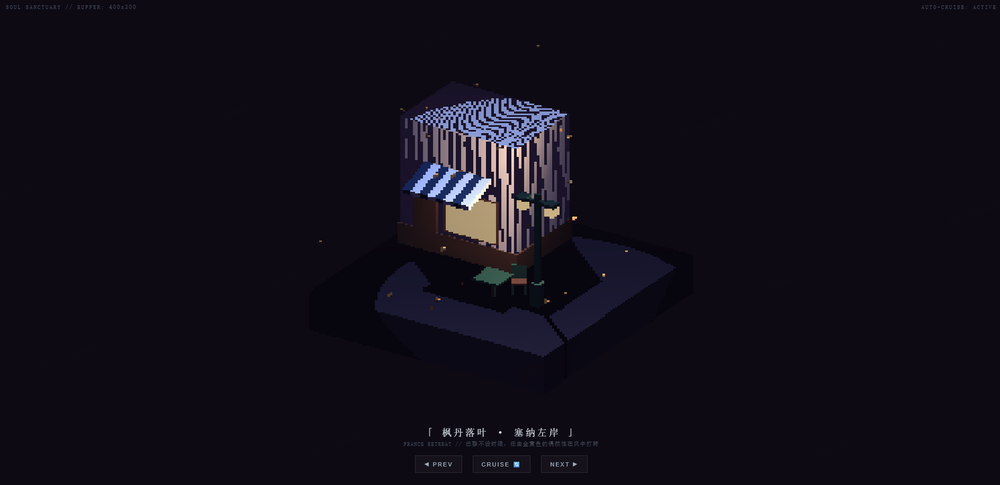
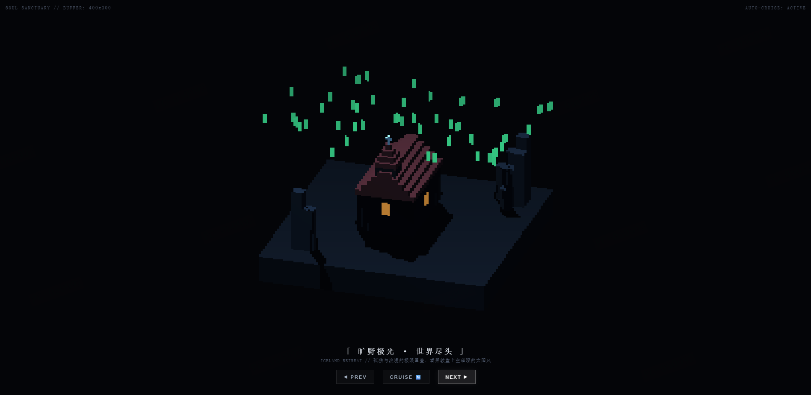

# 🌌 Soul Sanctuary | Global Pixel Pilgrimage

[](https://CNSleepybear.github.io/soul-sanctuary/)
[](https://threejs.org/)
[](https://en.wikipedia.org/wiki/Voxel)
[](LICENSE)

An interactive **WebGL voxel art installation** built with **Three.js**, featuring **12 procedurally generated spiritual retreats** from around the world. Each station is a self-contained diorama with unique architecture, atmospheric particle systems, and dynamic lighting — all rendered in crisp low-resolution pixel art style.

> *"Stop the mental churn. Let the cherry blossoms fall. Let the aurora dance. Let the snow bury the deadlines."*

---




## ✨ Features

### 🌍 12 Global Spiritual Retreats
Travel through **12 handcrafted voxel destinations**, each capturing the essence of a country's iconic atmosphere:

| Station | Country | Landmark | Particle System | Mood |
|:---|:---|:---|:---|:---|
| 🌸 Kyoto Twilight | Japan | Torii Gate & Sakura Tree | Falling Petals | Zen, ephemeral |
| 🎋 Bamboo Fireflies | China | Pavilion & Bamboo Grove | Floating Fireflies | Meditative, ancient |
| 🌵 Route 66 Dusk | USA | Neon Motel & Pickup Truck | Desert Dust Storms | Retro, rebellious |
| ☎️ Thames Rain | UK | Red Phone Booth & Street Lamp | London Downpour | Melancholic, cozy |
| 🍷 Left Bank Dusk | France | Café & Iron Lamp | Spinning Autumn Leaves | Romantic, wistful |
| 🏔️ Black Forest Night | Germany | Fachwerkhaus & Pine Trees | Steady Snowfall | Orderly, warm |
| 🛶 Venetian Drift | Italy | Gondola & Mooring Poles | Water Sparkles | Lazy, sensual |
| 🔥 Nyhavn Hearth | Denmark | Colorful Townhouses & Sailboat | Rising Smoke | Hygge, intimate |
| 🌌 World's End | Iceland | Black Church & Basalt Columns | Aurora Borealis | Solitary, sublime |
| 🪷 River Lanterns | Thailand | Stilt House & Golden Chedi | Floating Krathongs | Spiritual, flowing |
| 🔺 Valley of Kings | Egypt | Step Pyramid & Oasis | Desert Sand Drift | Timeless, monumental |
| 🌀 Aegean Windmill | Greece | Santorini Mill & Pergola | Sea Breeze Floaters | Bright, liberating |

### 🎮 Interactive Controls
- **Auto-Cruise Mode**: Automatically transitions between stations every 10 seconds
- **Manual Navigation**: `PREV` / `NEXT` buttons for deliberate exploration
- **CRUISE Toggle**: Pause the journey to linger in your favorite sanctuary
- **Mouse Drag**: Grab and rotate the diorama to inspect voxel details from any angle

### 🌧️ Dynamic Climate Matrix
Each station runs a **unique particle physics simulation**:
- **Falling** (Japan/France): Gravity-driven petals and leaves with sinusoidal drift
- **Firefly** (China): Orbital bioluminescence with pulsing scale and life-like flicker
- **Dust Storm** (USA): Horizontal wind shear with turbulent oscillation
- **Rain** (UK): High-velocity vertical drops with mist refraction lighting
- **Snow** (Germany): Damped descent with micro-drift, matching Germanic precision
- **Rise** (Italy): Buoyant water sparkles with gentle harmonic bobbing
- **Smoke** (Denmark): Chimney embers with lifecycle aging, sway dispersion, and height death
- **Aurora** (Iceland): Lateral solar-wind flow with Z-axis curtain wave physics
- **River Drift** (Thailand): Krathong lanterns with downstream current and wave-rocking
- **Float** (Greece): Weightless Aegean particles with wide orbital wandering

### 💡 Living Light Systems
- **Flickering Lanterns**: Candle/oil-lamp simulation using layered sine waves + random noise
- **Neon Fault Algorithm** (USA): 4% probability burst flicker simulating aging transformer contacts
- **Aurora Directional**: Green-tinted rim light casting across the black sand from celestial curtains
- **Hearth Breathing** (Denmark): Multi-frequency intensity modulation mimicking fireplace ember pulse

---

## 🚀 Live Experience

**🔗 [Launch Soul Sanctuary](https://CNSleepybear.github.io/soul-sanctuary/)**

### 🕹️ Controls

Zero learning curve — pure mouse interaction:

| Button | Function | Detail |
|:---|:---|:---|
| **◀ PREV** | Previous Station | Instant cut to the last retreat |
| **CRUISE 🔄** | Toggle Auto-Pilot | Pause/resume the 10-second auto-transition |
| **NEXT ▶** | Next Station | Advance to the next global sanctuary |
| **Drag Canvas** | Manual Orbit | Click and drag to rotate the diorama manually |

### 💡 Viewing Tips
1. **Let it cruise** first — the auto-transition is timed for meditative pacing
2. **Pause on your favorite** — hit CRUISE to stop and absorb the atmosphere
3. **Drag to inspect** — the voxel construction rewards close inspection (German timber framing, Thai chofa roofs, etc.)
4. **Full-screen recommended** — the pixel-stretch effect is most immersive at maximum viewport

---

## 🛠️ Tech Stack

- **Three.js r128**: WebGL rendering, procedural voxel geometry generation, shadow mapping
- **Orthographic Camera**: Classic isometric diorama perspective (no perspective distortion)
- **Low-Resolution Pipeline**: Internal 400×300 render buffer + CSS `image-rendering: pixelated` stretch
- **Procedural Materials**: All textures generated via `MeshLambertMaterial` with `flatShading: true` — zero external assets
- **Particle Physics Engine**: Per-station custom update loops (gravity, wind, buoyancy, lifecycle)
- **Dynamic Lighting**: `AmbientLight` + `PointLight` + `DirectionalLight` with real-time intensity modulation
- **Single-File Architecture**: Entire experience contained in one `index.html` — no build step, no dependencies beyond Three.js CDN

---

## 📦 Local Setup

### Requirements
- Modern browser with WebGL support (Chrome 90+ / Firefox 88+ / Edge 90+ / Safari 14+)
- Any local HTTP server (CORS required for Three.js module loading from CDN)

### Quick Start

```bash
# Clone the repository
git clone https://github.com/CNSleepybear/soul-sanctuary.git
cd soul-sanctuary

# Serve locally
python -m http.server 8000
# or
npx http-server -p 8000

# Open in browser
open http://localhost:8000
```

> **Note**: Opening `index.html` directly may trigger CORS errors with the Three.js CDN import. Use any local server.

---

## 📁 Project Structure

```
soul-sanctuary/
├── index.html          # Complete self-contained application (CSS + JS + HTML)
├── README.md           # This file
├── LICENSE             # MIT License
└── screenshots/        # Station preview images (optional)
```

> **Architecture**: Single-File Application. All 12 station builders, particle systems, lighting rigs, and UI controls are inlined. Deploy by copying one file to any static host.

---

## 🎨 Technical Deep Dive

### 1. Voxel Construction Engine
Every landmark is built from `THREE.BoxGeometry` primitives composed into hierarchical `Group` objects:

```javascript
// Japanese Torii Gate example
const postL = createBox(0.5, 4, 0.5, materials.torii, -2, 2, 0, true);
const tie = createBox(4.6, 0.4, 0.4, materials.torii, 0, 3.2, 0, true);
const topBar = createBox(5.4, 0.5, 0.6, materials.toriiTop, 0, 4.0, 0, true);
torii.add(postL, postR, tie, topBar);
```

**Notable architectural details:**
- **Germany**: X-brace timber framing (Fachwerkhaus), stepped gable roof layers, snow-cap chimney
- **Thailand**: 6-pillar stilt foundation, multi-tiered Chofa roof with golden finial, 8-layer Chedi stupa
- **Iceland**: Basalt column matrix with height-varied stacks, Reynisdrangar sea-stack replicas, steeple with voxel cross
- **USA**: Classic pickup truck (chassis/hood/cab/bed/4 wheels), neon sign with V-wing tail fins

### 2. Hard-Pixel Render Pipeline
```javascript
const RENDER_W = 400;
const RENDER_H = 300;
renderer.setSize(RENDER_W, RENDER_H, false); // Internal low-res
// CSS scales to fullscreen with zero interpolation:
// image-rendering: pixelated;
```
This creates the signature **crisp voxel edge** aesthetic without post-processing shaders.

### 3. Particle Physics Taxonomy
Each station registers its particles with a typed behavior tag:

| Type | Forces | Reset Condition |
|:---|:---|:---|
| `fall` | `-y gravity`, `±x sine drift` | `y < ground` |
| `firefly` | `orbital xz`, `±y bob`, `scale pulse` | `out of bounds` |
| `dust` | `-x wind`, `y oscillation` | `x < -6` |
| `rain` | `-y high velocity` | `y < 0.2` |
| `fall_spin` | `-y gravity`, `xz sway`, `xyz rotation` | `y < 0.15` |
| `snow` | `-y damped`, `±x micro-drift` | `y < 0.15` |
| `rise` | `+y buoyancy`, `±x sine` | `y > maxHeight` |
| `smoke` | `+y ascent`, `xz dispersion`, `age decay` | `age > maxLife` |
| `aurora` | `+x flow`, `z curtain wave`, `y ripple` | `x > 6` |
| `krathong` | `+z current`, `±x wave-rock`, `y bob` | `z > 5` |
| `drift` | `+z sand flow`, `y abs-sine` | `z > 5` |
| `float` | `+y levitation`, `wide xz orbit` | `y > 6` |

### 4. Light Flicker Algorithms
```javascript
// Standard candle: layered sine + noise
intensity = base + sin(elapsed * speed) * amp + cos(elapsed * speed * 1.5) * (amp * 0.5);

// Neon fault (USA): probabilistic blackout burst
if (Math.random() > 0.96) {
    intensity = 0.2; // Transformer contact failure simulation
    neonMats.forEach(m => m.color.setHex(darkened));
}
```

---

## 📝 Development Notes

### v1.0 Current Release
- ✅ 12 fully realized voxel dioramas with culturally specific architecture
- ✅ 12 independent particle physics systems
- ✅ Auto-cruise with manual override
- ✅ Responsive orthographic camera with window resize adaptation
- ✅ Dynamic lighting with per-station color palettes and flicker behaviors
- ✅ Zero external assets — pure procedural generation

### Roadmap
- 🔄 **Ambient Audio**: Procedural generative music per station (synth pads, rain noise, wind howl)
- 🔄 **Day/Night Cycle**: Smooth time-of-day transitions within each station
- 🔄 **Interactive Elements**: Clickable lanterns to toggle lights, clickable doors to "enter" buildings
- 🔄 **Mobile Gestures**: Swipe to change station, pinch to zoom orthographic scale
- 🔄 **VR Mode**: Stereo rendering for WebXR-compatible headsets
- 🔄 **Seasonal Variants**: Winter/Summer versions of each station (snow vs. green foliage)

---

## 🤝 Contributing

Pull requests and issues welcome! Priority directions:
- 🎭 New station proposals (Korea, Morocco, Peru, etc.)
- 🧩 Additional particle behaviors (butterflies, ash fall, cherry blossom blizzards)
- 🌐 Multi-language UI support
- 📱 Touch/gesture optimization
- 🎨 Post-processing experiments (bloom, chromatic aberration) as toggleable options

---

## 📄 License

**MIT License** — see [LICENSE](LICENSE) for details.

> All voxel designs and atmospheric concepts are original. Cultural landmarks are stylized abstractions, not exact replicas.

---

## 🙏 Acknowledgments

- **Three.js**: The indispensable WebGL abstraction layer
- **r/pixelart & r/voxelart**: Communities that keep the low-res aesthetic alive
- **Lo-Fi Girl / ChilledCow**: Sonic inspiration for the meditative pacing
- **Tourist Eye**: The real-world beauty that made these 12 stations worth building

---

⭐ **If Soul Sanctuary gave you 30 seconds of peace, consider starring the repo. The world needs more quiet corners.**

*To all the late-night debug sessions, the unread notifications, and the deadlines that can wait until tomorrow — this sanctuary is for you.*
